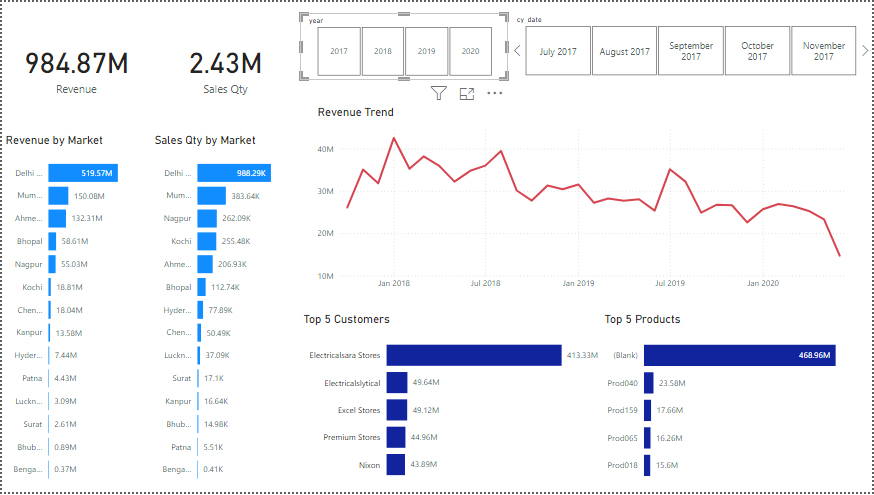

# AtliQ Sales Dashboard with Power BI

## Overview
This project involves the development of a dynamic sales dashboard utilizing the AIMS GRID methodology to provide actionable insights for the Sales Director at AtliQ. The goal is to uncover previously hidden sales trends, empowering the sales team to make informed, data-driven decisions. Additionally, the project will automate data collection processes, reducing manual effort and enhancing operational efficiency.

## Success Criteria

- Deliver a comprehensive dashboard that reveals critical sales order insights using the most up-to-date data.
- Support the sales team in making informed decisions that result in a 10% reduction in total spending.
- Automate manual data collection processes, saving 20% of the sales analyst's time, which can then be reinvested into higher-value tasks.

## Tools Used
During the course of the project I used the following:

- **SQL:** For accessing and querying the database.

- **Tableau:** For creating Visualizations and Dashboard.

- **Git & GitHub:** For version control and sharing my Python code and analysis, ensuring collaboration and project tracking.

## Files

- **db_dump.sql:** This file contains the dataset required for this analysis.

- **Sales_Data.pbix:** The Power BI file containing the sales dashboard.
- **README.md:** Documentation for the project.

## Key Features

- **Sales Performance Overview:** Displays total sales amount, sales quantity, and normalized sales for better comparison across regions and currencies.
- **Top Performing Products:** Visual breakdown of the products that contribute the most to sales.
- **Customer Segmentation:** Insight into sales patterns by customer groups.
- **Market Analysis:** Performance comparison across different markets.
- **Dynamic Filters:** Interactive filters to explore the data by product, customer, market, and order date.

## Data Model
The data in this Power BI file is structured around the following key fields:

- **product_code:** Unique code for each product.
- **customer_code:** Unique code for each customer.
- **market_code:** Represents different sales markets.
- **order_date:** Date of the sales transaction.
- **sales_qty:** Quantity of products sold.
- **sales_amount:** Total revenue from the sale.
- **currency:** The currency used in the transaction.
- **norm_sales_amount:** Normalized sales amount to account for different currencies.

## Usage Instructions
1. Download the Sales_Data.pbix file from this repository.
2. Open the file using Power BI Desktop.
3. If prompted, update the data source to point to your own data file (if applicable).
4. Interact with the dashboard by using filters and visualizations to gain insights into sales data.

## Visuals
The dashboard contains several types of visualizations to help interpret the data effectively:

- Bar charts for sales by product, customer, and market.
- Line graphs showing trends over time.
- Tables for detailed data views.
- KPI cards for total sales and sales quantities.

## Requirements
- **Power BI Desktop:** Download it from Power BI Desktop.
- **Data Source:** If you want to update the data source, ensure that the structure matches the existing data model.

## How to Customize
1. Open the .pbix file in Power BI.
2. Modify the data connections or add new data sources as needed.
3. Customize the visuals or create new reports to suit your needs.
4. Publish the report to Power BI Service or share the .pbix file with other users.

## Results
Below is a snapshot of the dashboard:

## Conclusion
The Sales Dashboard provides a comprehensive overview of key performance indicators (KPIs) related to sales across products, customers, and markets. Through detailed data visualizations and interactive elements, users can quickly identify top-performing areas and those that require improvement. The dashboard offers valuable insights into sales trends, customer behavior, and market opportunities, making it a crucial tool for sales managers, analysts, and decision-makers.

Overall, the dashboard facilitates informed decision-making by simplifying the process of analyzing large volumes of sales data, providing clear, actionable insights to drive business growth.